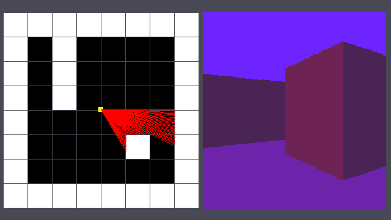

# Cimmerian

*Cimmerian* is a pseudo 3D game, or raycasting game, written in C89. It means 
that a 2D map is translated into 3D. Examples of such games are Wolfenstein 3D 
or Doom.  

The libraries in use are:
- naturally the C standard library,
- OpenGL (Open Graphics Library) for the graphics,
- GLFW (OpenGL Framework) for the windowing and input handling,
- and OpenAL (Open Audio Library) for the audio.

I've decided to specialize in Unreal Engine, so why am I even working on a low 
level project? Because it's fun. Moving on... No seriously, I've always wanted 
to work on such a project, so I'm happy to nibble at this from time to time. 
The aim isn't to make it a commercial project, although that's not out of the 
question neither. The purpose is to experiment and scratch my low level itch.  

## Levels

Give a specific \*.map file as argument to the program, or don't give any to 
default to "maps/olafur/mus.map".  

- maps/test/\*:  
The Test level is where I develop features.  

- maps/olafur/\* (recommended entry "mus.map"):  
The Olafur level is a museum where each painting leads to another mini-world. 
It has been designed by Hellchauffo, 
([Figma](https://www.figma.com/proto/UshKwYvv5vY0WgejO4WXR2/Workflow?node-id=82-974) 
and [GitHub](https://github.com/Lucie-Kin)), a friend of mine. She is behind 
the concept, the map layouts, the sprites, the textures and the choice of music 
tracks. This has been quite the undertaking and I thank her for this work. This 
level was designed in the context of a school project we worked on together, a 
pseudo-3D game as well, and she allowed me to keep Olafur for my personal 
project. This comes in quite handy, as I now have a level to showcase what the 
game is capable of. As for my contribution to Olafur, I've picked the elevator 
music, the sound effects, and added an easter egg accessible from the 
elevator (and through your keyboard).  

## Commands

Move forward: W or UP arrow key  
Move backward: S or DOWN arrow key  
Rotate left: A or LEFT arrow key  
Rotate right: D or RIGHT arrow key  
Move left: Q  
Move right: E  
Speed: Press SHIFT to run, release to walk  

Quit: ESC  
Backspace: Reset player's position and rotation  
Toggle fullscreen: F11  
Toggle FPS counter: F12  
