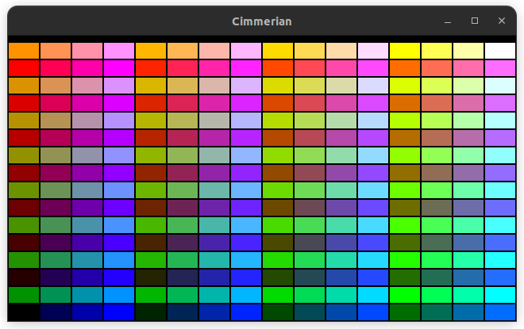

# Cimmerian

*Cimmerian* is a pseudo 3D game written in C89 and similar to the likes of Wolfenstein 3D. Since *Cimmerian* is of retro inspiration, I pushed the idea for the art style, and went for big pixels and for a limited color palette.  

The libraries used are:
- naturally the C standard library,
- OpenGL (Open Graphics Library) for the graphics,
- GLEW (OpenGL Extension Wrangler Library) to encourage the use of the latest OpenGL version available on the machine,
- GLFW (OpenGL Framework) for the windowing (= GUI & input handling),
- and OpenAL (Open Audio Library) for the audio.

I've decided to specialize in Unreal Engine, so why am I even working on a low level project? Because it's fun. Moving on... No seriously, I've always wanted to work on such a project, so I'm scratching this itch before going full throttle into Unreal.  

## Technical Explanations

I love the C programming language, and specifically C89 which is the version from 1989, but it also fits nicely into the idea of going retro. Being limited is also a good challenge for me, and there are different aspects to this project which limit my range of actions. For starters, C89 being an old version, it has limited features and a slightly stricter writing style.  

Language aside, I've gone with OpenGL for the graphics library, and it's not for a technical reason and simply because I've always wanted to, for some reason. This is my first dive into low level graphics programming. From the beginning, I intended for *Cimmerian* to be a pseudo 3D game and not actual 3D, but if you look into the commit history you'll see that I've dabbled into real 3D before going back to pseudo. It was a great learning experience, and gave me an introduction to modern graphics programming. However, this was too difficult for me to figure out at this time so I couldn't go on this way, and went back to pseudo, which as previously stated was my intent anyway.  

What even is "pseudo 3D"? Any graphics library, even LÖVE (or Love2D) which is a Lua framework, can be used to develop a pseudo 3D game. It simply requires to draw pixels on the screen. Basically, we take a 2D map which indicates where walls and objects are, and we translate it into 3D. The walls are cubes, the objects are sprites (= flat images) instead of 3D... Through the power of math (mostly trigonometry), these pixels can emulate 3D.  

Going back to OpenGL, the "real 3D" detour taught me precious concepts. Precisely, when looking up raycasting tutorials which use OpenGL as an example, deprecated features are likely to be used, because the purpose is not to teach the library but the concept of raycasting. Thanks to this detour, I know that the "fixed function pipeline"/"immediate rendering mode" is deprecated, and that the "programmable pipeline"/"retained rendering mode" is the current way of doing things. It's about using shaders, and it's not only more efficient for the machine, it's the basics of modern graphics programming.  

In the intro, I've mentioned big pixels. Here is the explanation: All the window contains is a texture, and I've made it so the game can be displayed in fullscreen mode, which means that if the texture resolution is less than the screen's, the pixels would appear blurry. Therefore, in order to keep the image sharp, the texture has the same amount of pixels as the screen can display. The pixels are not big, but it's simpler to word it this way. In actuality, I just work with "points" instead of pixels. There's always 640x360 points in the texture, no matter the screen resolution, which for a 1920x1080 screen means that a point will be of a size of 3x3 pixels. This is what I meant by "big pixels".  

About the palette, modern technology can display what is commonly called "true color", which represents 16,777,216 different colors. Long story short, this diversity is possible because 3 bytes are used to store the color. However, I wanted to fit the whole color into 1 byte as a challenge (and as a fashion statement), which makes the possible combinations go from over 16 millions to 256. The name of this specific color format is RGB332, and here's a screenshot of the 256 colors.  

